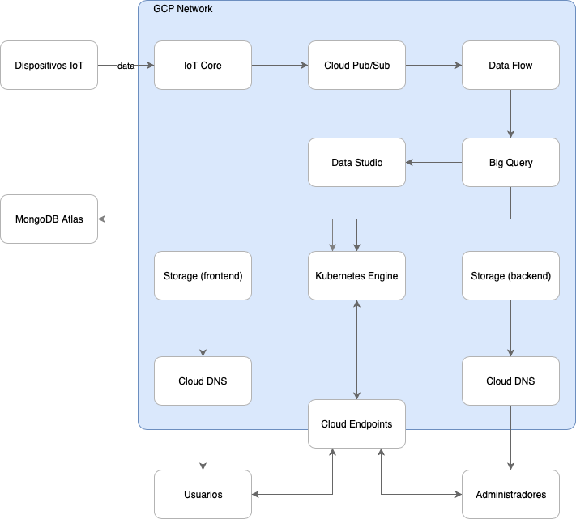

# *Quejatec cloud system*
---
#### Materia: *Desarrollo de aplicaciones en la nube TC3059*

##### Campus: *Santa Fé*

##### Integrantes:
1. *Enrique Alejandro Mondragón Tayabas*

---
## 1. Aspectos generales

### 1.1 Requerimientos técnicos

A continuación se mencionan los requerimientos técnicos mínimos del proyecto, favor de tenerlos presente para que cumpla con todos.

* El equipo tiene la libertad de elegir las tecnologías de desarrollo a utilizar en el proyecto, sin embargo, debe tener presente que la solución final se deberá ejecutar en una de las siguientes plataformas en la nube: [Google Cloud Platform](https://cloud.google.com/?hl=es), [Amazon Web Services](https://aws.amazon.com/) o [Microsoft Azure](https://azure.microsoft.com/es-mx/).
* El proyecto deberá utilizar 
* La solución debe utilizar una arquitectura de microservicios. Si no tiene conocimiento sobre este tema, le recomendamos la lectura [*Microservices*](https://martinfowler.com/articles/microservices.html) de [Martin Fowler](https://martinfowler.com).
* La arquitectura debe ser modular, escalable, con redundancia y alta disponibilidad.
* La arquitectura deberá estar separada claramente por capas (*frontend*, *backend*, *API RESTful*, datos y almacenamiento).
* Deberá utilizarse contenedores [Docker](https://www.docker.com/) y un orquestador como [Kubernetes](https://kubernetes.io/).
* La API deberá utilizar autenticación y estar desplegada detrás de un API Manager como [Cloud Endpoints](https://cloud.google.com/endpoints/).
* El proyecto deberá contar con los archivos de configuración y *scripts* necesarios para crear toda la infraestructura necesaria, utilizando alguna solución de *Infraestructure as a Code* como [Deployment Manager](https://cloud.google.com/deployment-manager/).
* Todo el código, *datasets* y la documentación del proyecto debe alojarse en este repositorio de GitHub. Favor de mantener la estructura de carpetas propuesta.

### 1.2 Estructura del repositorio
El proyecto debe seguir la siguiente estructura de carpetas, la cual generamos por usted:
```
- / 			        # Raíz de todo el proyecto
    - README.md			# Archivo con los datos del proyecto (este archivo)
    - frontend			# Carpeta con la solución del frontend (Web app)
    - backend			  # Carpeta con la solución del backend (CMS)
    - api			      # Carpeta con la solución de la API
    - datasets		  # Carpeta con los datasets y recursos utilizados (csv, json, audio, videos, entre otros)
    - dbs			      # Carpeta con los modelos, catálogos y scripts necesarios para generar las bases de datos
    - models			  # Carpeta donde se almacenarán los modelos de Machine Learning ya entrenados
    - docs			    # Carpeta con la documentación del proyecto
```

### 1.3 Documentación  del proyecto

Como parte de la entrega final del proyecto, se debe incluir la siguiente información:

* Descripción del problema a resolver.
* Diagrama con la arquitectura de la solución.
* Descripción de cada uno de los componentes de la arquitectura.
* Justificación de los componentes seleccionados.
* Explicación del flujo de información en la arquitectura.
* Descripción de las fuentes de información utilizadas (archivos CSV, JSON, TXT, bases de datos, entre otras).
* Guía de configuración, instalación y despliegue de la solución en la plataforma en la nube seleccionada.
* Documentación de la API. Puede ver un ejemplo en [Swagger](https://swagger.io/).
* El código debe estar documentado siguiendo los estándares definidos para el lenguaje de programación seleccionado.

## 2. Descripción del proyecto

En el ITESM Campus Santa Fé como en diferentes organizaciones e instituciones en el mundo, los estudiantes, profesores, empleados y usuarios, se encuentran con la problemática de no contar con un sistema accesible para poder reportar cualquier falla en el servicio inmobiliario. Se han tratado de implementar algúnos de los sistemas actuales de reporte, pero estos no son tan accesibles y en la mayoría de la veces no cuentan con un mecanismo de dar seguimiento a cualquier reporte por parte del usuario para de esta forma garantizar que el problema sea resuelto.

## 3. Solución

A continuación aparecen descritos los diferentes elementos que forman parte de la solución del proyecto.

### 3.1 Arquitectura de la solución



Tenemos dos principales flujos que alimentan de información la plataforma.

La primera es a través de los usuarios, los cuales acceden a través del Cloud DNS descargando desde un servicio estático "Storage" una "Single Page Aplication" para que esta sea quien que enviarán sus calificaciones y sus quejas a al servidor y este a la base de datos "dentro de GKE" así como el inicio de sesión que se hace utilizando el servicio de "Cloud Enpoints".

El segundo es para los dispositivos de IoT los cuáles se administrar utilizando el servicio IoT core y este dirige los datos transmitidos a un tópico de "Pub/Sub" el cuál administra una cola de eventos para que el subscriptor, en este caso "Data flow", se encargue de procesar la información recibida y almacenarla en BigQuery, y posteriormente a Data studio para visualizar la información.

### 3.2 Descripción de los componentes

* VPC Networks: Se requerirá de una red donde se manejan los servicios de backend, frontend y api.
* Kubernetes Engine: Se utilizará para dar el servicio de api a la aplicación, permitiendo alta disponibilidad.
* Storage: Se utilizará para servir los archivos estáticos de las aplicaciones de frontend y backend.
* Cloud DNS: Maneja el dominio adquirido el cuál permite utilizar en storage un "bucket" como servicio de páginas web estáticas.
* Endpoints: Servirá para identificar y autentificar a los usuarios utilizando id de google.
* IoT Core: Administra los dispositivos de IoT que se quieran conectar a la plataforma.
* Cloud Pub/Sub: Se encargá del manejo de eventos para los datos entre los dispositivos IoT y GCP.
* Dataflow: Este servicio transforma los datos recibidos por los dispositivos de IoT en un formato y lo inserta a una tabla en BigQuery.
* BigQuery: Albergará los datos recibidos por el dataflow de los dispositivos IoT.

### 3.3 Frontend

Para el frontend se buscó realizar una aplicación web amigable al usuario la cuál pueda ser cargada de forma rápida y que no dependiera de un servidor con acceso a los recursos de la solución, una aplicación que corriera 100% en el cliente y realizara consultas a un API.

#### 3.3.1 Lenguaje de programación

Se utiliza como lenguaje de programación [Typescript](https://www.typescriptlang.org) el cuál es un subset de javascript.

#### 3.3.2 Framework

Dada la experiencia del equipo de desarrollo y la basta documentación sobre este framework se decidió utilizar [Angular](https://angular.io).

#### 3.3.3 Librerías de funciones o dependencias

Se utilizó una librería principal llamada "[material](https://material.angular.io)" la cuál nos proporciona elementos de UI y componentes de angular listos para usar.

### 3.4 Backend

Para el backend igualmente se realizó una aplicación que corre 100% del lado del cliente y está realizada de forma estandarizada para poder crecer a futuro.

#### 3.4.1 Lenguaje de programación

Se utiliza como lenguaje de programación [Typescript](https://www.typescriptlang.org).

#### 3.4.2 Framework

Se utiliza [Angular](https://angular.io) en la versión 8.

#### 3.4.3 Librerías de funciones o dependencias

Aquí se utilizaron recursos que previamente se tenían realizados localmente. Forms componente y Table component

Se utiliza la librería [@swimlane/ngx-charts](https://www.npmjs.com/package/@swimlane/ngx-graph) la cuál nos da una interfáz para graficar datos de forma amigable al usuario.

Igualmente se utilizó una librería principal llamada "[material](https://material.angular.io)" la cuál nos proporciona elementos de UI y componentes de angular listos para usar.

### 3.5 API

El servidor de punto de acceso se realizó pensando en utilizar un lenguaje que permitiera a los desarrolladores trabajar en frontend y backend al mismo tiempo sin muchas complicaciones.

#### 3.5.1 Lenguaje de programación

Javascript es el lenguaje que se eligió y este sobre el "runtime" [nodejs](https://nodejs.org/en/).

#### 3.5.2 Framework

Para realizar las rutas de manera fácil se utilizó [ExpressJS](https://expressjs.com).

#### 3.5.3 Librerías de funciones o dependencias

[Dotenv](https://www.npmjs.com/package/dotenv): se utiliza para leer un archivo de variables de ambiente.
[Bcrypt](https://www.npmjs.com/package/bcrypt): esta librería hashea las contraseñas de los usuarios.
[mongoose](https://mongoosejs.com): cliente para conectarse a un servidor de mongodb y abstrae a objetos los modelos.
[mongoose-pagination](https://www.npmjs.com/package/mongoose-pagination): librería que extiende mongoose para realizar paginación en colecciones.

* **Descripción**:
* **URL**:
* **Verbos HTTP**:
* **Headers**:
* **Formato JSON del cuerpo de la solicitud**: 
* **Formato JSON de la respuesta**:

[API documentation -> ./docs/api-def.md](./docs/api-def.md)

## 3.6 Pasos a seguir para utilizar el proyecto

### 3.6.1 API

```bash
$ gcloud config set project
$ cd api/
$ docker build -t gcr.io/<project-id>/kube-api:latest .
$ gcloud docker -- push gcr.io/proyectointegrador-253221/kube-ap
$ gcloud deployment-manager deployments create kube-api --config ./kb-cluster.yaml
```

### 3.6.1 Cloud DNS

* Darpermisos de utilizar el dominio
* Crear la zona del dominio

### 3.6.1 Frontend

```bash
$ cd frontend/
$ gcloud deployment-manager deployments create frontend-bucket --config ./storagebucket.yaml

```

### 3.6.1 Backend

```bash
$ cd backend/
$ gcloud deployment-manager deployments create backend-bucket --config ./storagebucket.yaml

```

## 4. Referencias

Autenticación de usuarios con Node.js  |  Node.js  |  Google Cloud. (0AD). Retrieved from https://cloud.google.com/nodejs/getting-started/authenticate-users?hl=es-419
Automated Static Website Publishing with Cloud Build  |  Google Cloud Platform Community  |  Google Cloud. (0AD). Retrieved from https://cloud.google.com/community/tutorials/automated-publishing-cloud-build

AVR-IoT on Google Cloud. (0AD). Retrieved from https://codelabs.developers.google.com/codelabs/avr-cloud-iot/#0

Building a Node.js App on App Engine  |  App Engine standard environment for Node.js docs  |  Google Cloud. (0AD). Retrieved from https://cloud.google.com/appengine/docs/standard/nodejs/building-app/hhsadiqhhsadiq 1. (1966, October 1). 

Deploying angular2 web app on google cloud buckets. Retrieved from https://stackoverflow.com/questions/38053113/deploying-angular2-web-app-on-google-cloud-buckets

Identity and authentication, the Google Cloud way | Google Cloud Blog. (0AD). Retrieved from https://cloud.google.com/blog/products/identity-security/identity-and-authentication-the-google-cloud-wayMicrochipTech. (0AD).

MicrochipTech/gcp-iot-core-examples. Retrieved from https://github.com/MicrochipTech/gcp-iot-core-examples/wiki/Getting-Started

Serving an Angular App's Static Files from Google Cloud Storage (Part 15). (2019, January 22). Retrieved from https://dragonprogrammer.com/serve-angular-files-cloud-storage/


https://www.medallia.com/net-promoter-score/
